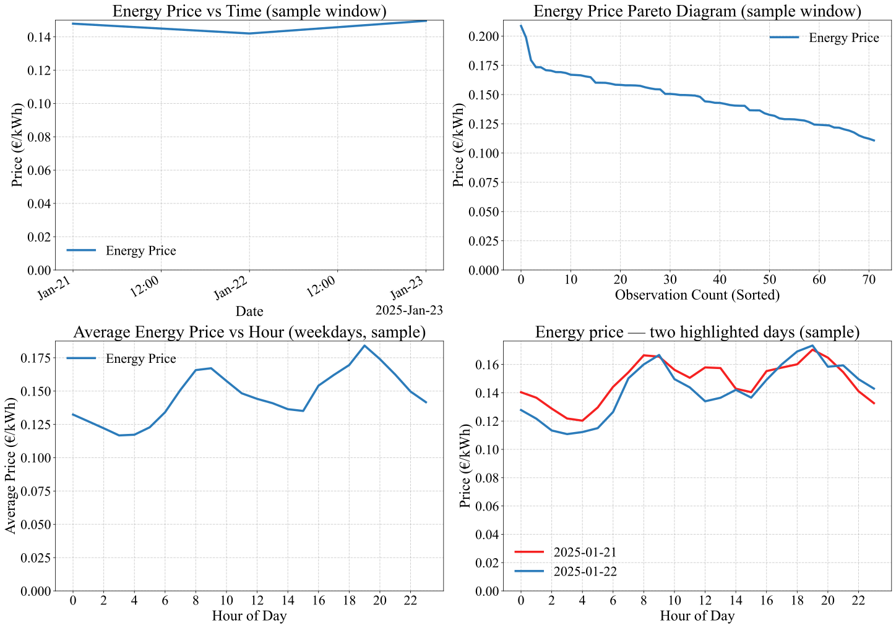
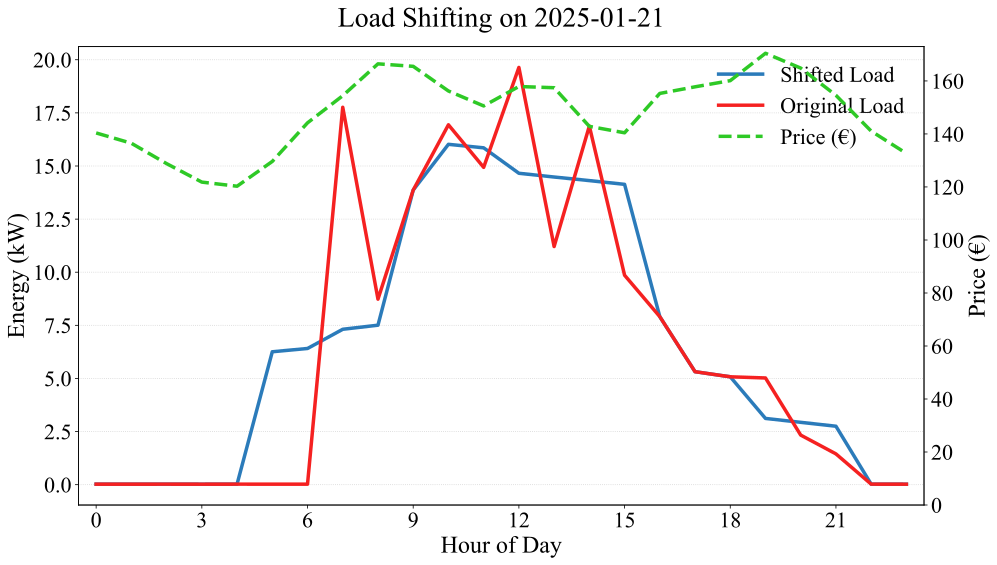
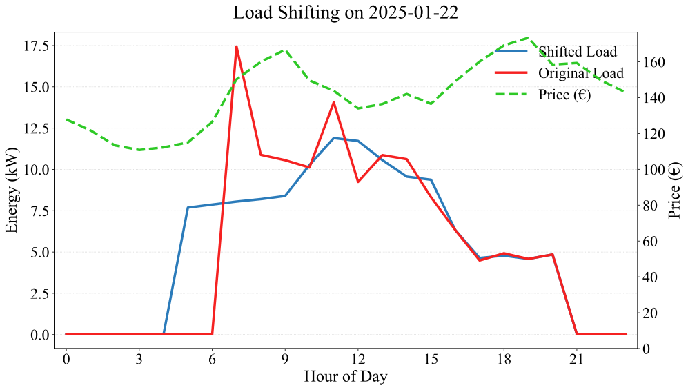
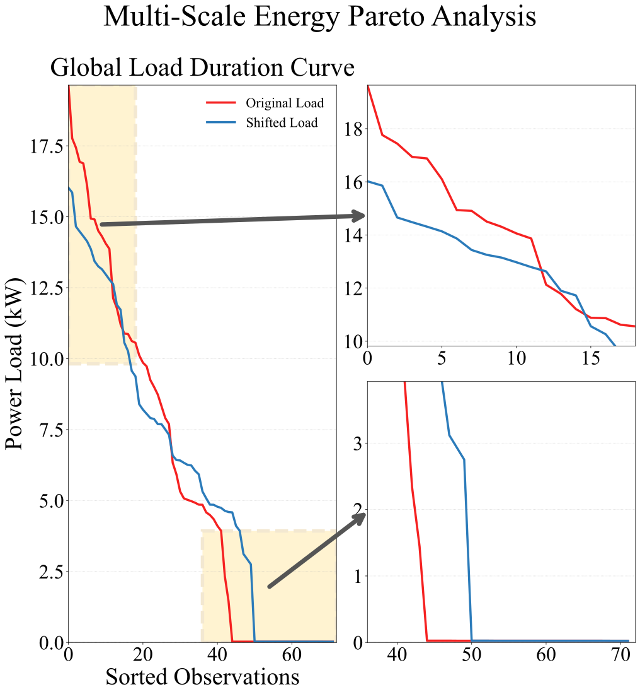
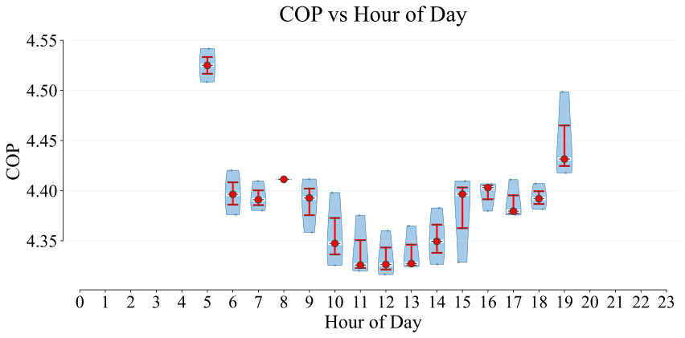
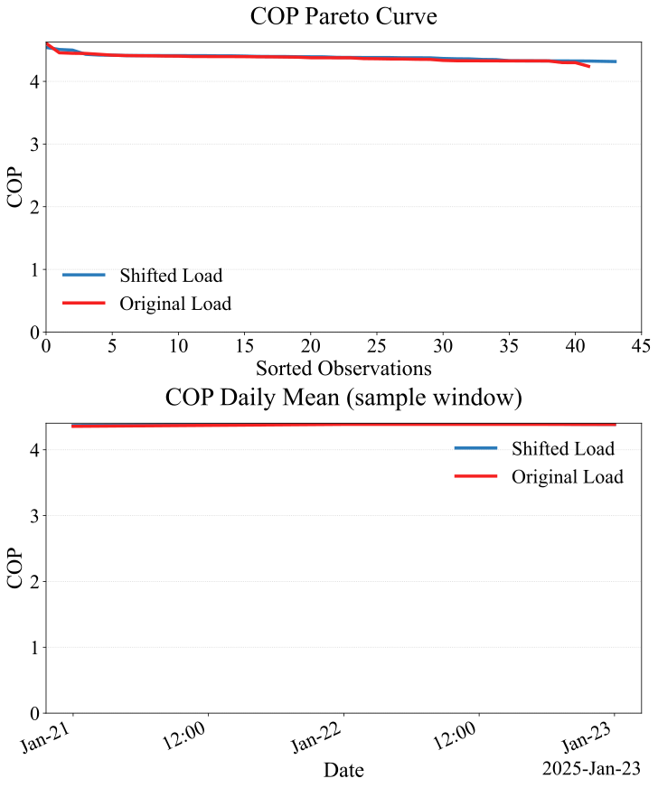
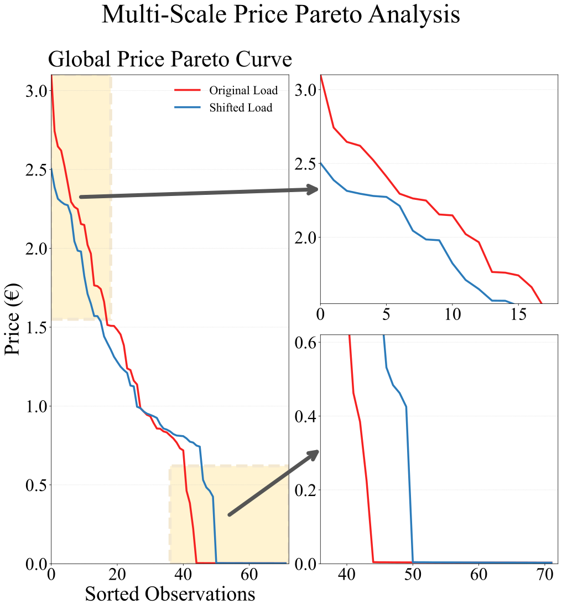

# Heat Pump Analysis and Load Optimization

This repository contains the code used to analyze the operational performance of a ground-source heat pump plant serving a large tertiary building, and to evaluate demand-side management strategies based on electricity price signals. The pipeline ingests hourly thermal load and electricity price data, runs a load-shifting optimization algorithm, characterizes system efficiency through COP modeling, and produces a complete set of publication-quality figures together with a JSON metrics summary. Everything is implemented as a single self-contained Python script (`src/load_optimization.py`) with a command-line interface.

## Context

The growing penetration of heat pumps in the building sector introduces new challenges at the intersection of energy efficiency and operating costs. Because electricity prices fluctuate significantly throughout the day — particularly in liberalized markets with time-differentiated tariff structures — there is a meaningful opportunity to reorganize thermal loads in time without compromising occupant comfort. This is especially relevant for large buildings with predictable occupancy patterns and measurable thermal inertia, where a portion of the heating or cooling demand can be brought forward or delayed by one or two hours at a modest energy penalty.

This work focuses on a real operating ground-source heat pump installation in a multi-rise education and office building. Unlike simulation-based studies, the analysis is grounded entirely in measured operational data, which introduces realistic variability and constraints absent from idealized models. The study examines plant sizing adequacy, efficiency trends across the year, and the economic effect of shifting loads toward lower-price windows of the Spanish wholesale electricity market.

## Process and Methodology

The analysis pipeline follows a sequence of well-defined steps, from raw data ingestion through optimization and reporting:

- **Data preparation:** Hourly records of electrical consumption, thermal output per heat pump unit, and market electricity prices are loaded and parsed. Active operating hours are identified automatically from the electrical activity signal, and a preconditioning buffer before building opening is incorporated.
- **COP modeling:** Instantaneous efficiency is noisy due to hydraulic variability and part-load cycling. Inactive periods and low-load transients below the 25th percentile are removed, and a polynomial regression model is fitted to map electrical input to COP. This model is used to reconstruct hourly efficiency estimates and aggregate them into daily and weekly indicators.
- **Load-shifting algorithm:** Two complementary strategies are applied hour-by-hour only when the destination period has a lower electricity price than the origin: *load anticipation* (moving consumption one hour earlier, with a 5% inefficiency penalty) and *load delay* (shifting to the following hour without penalty). The algorithm enforces three constraints to preserve operational feasibility: a symmetry bandwidth limiting the global upward or downward deviation from the historical peak, a cap of 40% of the historical maximum on any individual load change, and restriction of all shifts to the identified active window.
- **Cost accounting:** Hourly electricity costs are computed by combining wholesale market prices with Spanish regulated transmission and distribution charges, yielding an accurate effective cost per kWh for each time step.
- **Metrics and figures:** The pipeline computes variance metrics (energy, cost, peak load) at daily, monthly and full-period scales, and generates seven SVG figures covering price dynamics, daily load profiles before and after shifting, load duration curves, COP distributions, and price Pareto analyses.

To run the pipeline on the included sample data:

```bash
conda env create -f environment.yml
conda activate heatpump-load-shifting
python src/load_optimization.py --price-csv data/load-shifting-price.csv --output-dir figures/ --public-sample
```

> **Note on data availability:** The full operational dataset used in the associated research paper is private and cannot be released publicly. The `data/` folder contains a small sample covering a few days of measurements, included solely to demonstrate that the code runs correctly and produces meaningful outputs. All figures in this repository are generated from that sample; quantitative results will differ from those reported in the paper, which was produced from a full year of data.

## Results

The load-shifting algorithm successfully redistributes thermal demand toward lower-price intervals without materially degrading system efficiency. On days with high heating loads, anticipating demand ahead of building occupancy flattens the morning peak and reduces costs during the most expensive market intervals. On moderate-load days the effect is more pronounced, with a larger share of morning consumption shifted to the preconditioning window. Across the full annual dataset used in the paper, daily peak loads were reduced in a range spanning from roughly 8% to 60%, and nearly 1 MWh of electrical demand was moved to lower-cost periods, translating into a reduction in annual energy expenditure of approximately 2.5% with only a marginal increase in total energy consumed.

System efficiency, measured through the Coefficient of Performance, is preserved under the shifted schedule. The weekly average COP tracks the original baseline closely throughout the year, confirming that the economic benefit is not offset by a degradation in thermodynamic performance. The load duration curve analysis further shows that peak power requirements are reduced, suggesting that intelligent demand management could allow equivalent service with lower-rated installed equipment.

| Figure | Description |
|--------|-------------|
|  | Annual price evolution, price duration curve, average hourly profile on working days, and representative daily price patterns |
|  | Comparison of original and shifted load profiles for a sample day, overlaid with the hourly price signal |
|  | Second sample day showing load redistribution and price-driven optimization |
|  | Global load duration curve comparing original and shifted loads, with insets highlighting peak reduction and energy recovery |
|  | Hourly COP distribution by time of day across the study period |
|  | COP duration curve and weekly average COP for original and shifted scenarios |
|  | Multi-scale price Pareto showing successful redistribution of consumption from high-cost to low-cost intervals |

## Authors

**Aitor Díez Mateo** — Institute of Technology, Faculty of Engineering, University of Deusto, Bilbao, Spain · [aitor.diez@opendeusto.es](mailto:aitor.diez@opendeusto.es)

**Roberto Garay-Martinez** — Institute of Technology, Faculty of Engineering, University of Deusto, Bilbao, Spain · [roberto.garay@deusto.es](mailto:roberto.garay@deusto.es)

**Jose Ignacio García Quintanilla** — Institute of Technology, Faculty of Engineering, University of Deusto, Bilbao, Spain · [jigarcia@deusto.es](mailto:jigarcia@deusto.es)

---

*This work was supported by the European Union's Horizon Europe research and innovation programme under grant agreements No 101172968 (Project STUNNED) and No 864374 (Project ATELIER). The authors gratefully acknowledge TELUR Geotermia y Agua S.A. for granting access to the operational data that underpins this research.*
